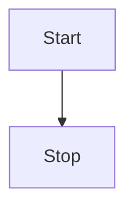
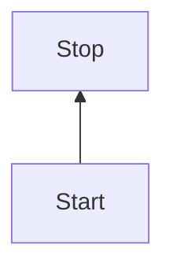
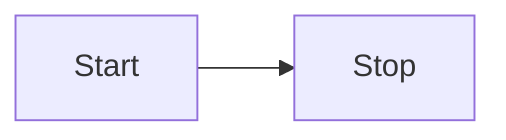
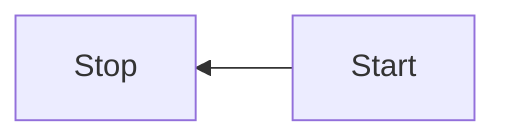

# グラフ方向 (Orientation)

## 垂直方向 (Vertical)

### Top Down (TD) / Top to Bottom (TB)

```mermaid
flowchart TD
    Start --> Stop;
```

```mermaid
flowchart TB
    Start --> Stop;
```

### Bottom to Top (BT)

```mermaid
flowchart BT
    Start --> Stop;
```

## 水平方向 (Horizontal)

### Left to Right (LR)

```mermaid
flowchart LR
    Start --> Stop;
```

### Right to Left (RL)

```mermaid
flowchart RL
    Start --> Stop;
```
