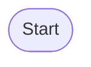
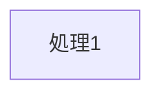
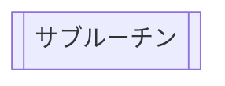
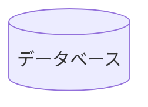
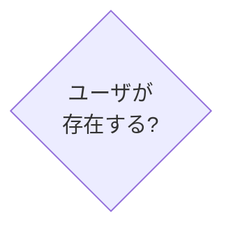
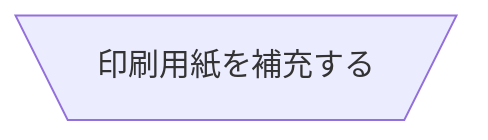

# 形 (Shape)

## 端子 (Terminator)

## 処理 (Process)

## 代替処理 (Alternate Process)

## 定義済み処理 (Predefined Process)

## データベース (Database)

## 結合子 (Connector)

## 条件 (Decition)

## 前処理 (Preparation)

## 入出力 (Input / Output / Data)

## 手入力 (Manual Operation)

