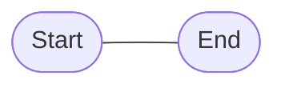
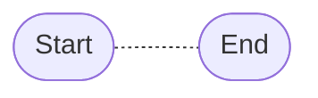
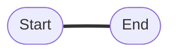
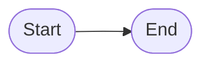
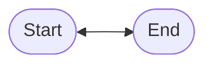
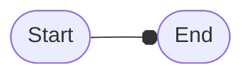
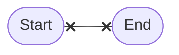
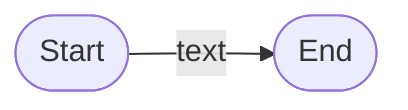
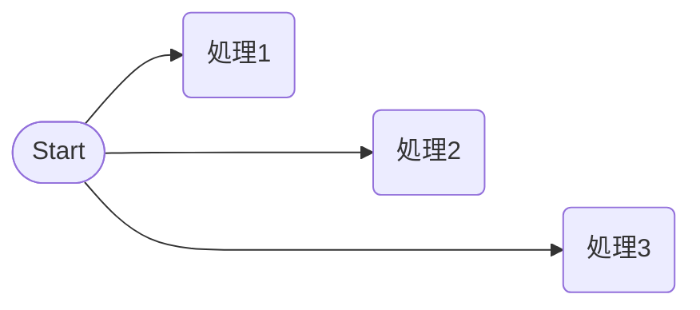

# リンク (Link)

## 線 (Line)

### 直線



### 破線 (Dotted)



### 太線 (Bold)



## 矢印 (Arrow)

### 単方向 (One way)



### 両方向 (Two way)



## その他





## テキスト (Text)

```mermaid
flowchart LR
    A(["Start"]);
    B(["End"]);
    A---|text|B;
```



## 線の長さ (Length)


