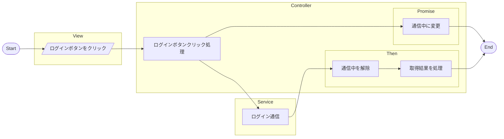

# サブグラフ

```mermaid
flowchart LR
    S1(["Start"]);
    E1(["End"])
    subgraph View
        I1[/"ログインボタンをクリック"/]
    end
    subgraph Controller
        P1["ログインボタンクリック処理"]
        subgraph Promise
            P2["通信中に変更"]
        end
        subgraph Then
            P3["通信中を解除"]
            P4["取得結果を処理"]
        end
    end
    subgraph Service
        C1["ログイン通信"]
    end

    I1 --> P1;
    S1 --> I1;
    P1 --> C1;
    P1 --> P2;
    C1 ---> P3;
    P2 --> E1;
    P3 --> P4;
    P4 --> E1;
```
